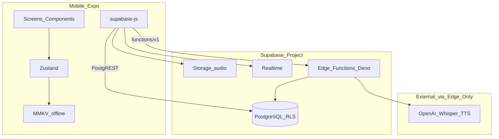

# Tech Stack & Architecture — Học cùng Bee

> **SSOT công nghệ** · Workplace English with Bee  
> **Quyết định:** **Chỉ Supabase** — không server Express/Railway/Render riêng.  
> **Liên quan:** [`requirement_base.md`](../00_input_raw/requirement_base.md) · [`sys_design_ux_ui.md`](sys_design_ux_ui.md) · [`api_specs/api_design.md`](api_specs/api_design.md) · [`process/00_requirement_business.md`](../../process/00_requirement_business.md)

---

## 1. Tổng quan kiến trúc (Supabase-only)

Ứng dụng **mobile-first** (Expo) kết nối trực tiếp **Supabase**: PostgreSQL (PostgREST), Storage, Realtime, và **Edge Functions** cho logic có secret (AI, SRS, STT).



| Thành phần | Vai trò |
|-----------|---------|
| **PostgREST** | CRUD bảng (`vocabulary`, `user_vocabulary`, …) qua `@supabase/supabase-js` |
| **RLS** | Mọi row user-scoped theo `device_id` (gắn qua anonymous session hoặc claim — xem API doc) |
| **Edge Functions** | AI chat, STT, chấm phát âm, `learning-review` (SRS), orchestration phức tạp |
| **Storage** | File audio speaking |
| **Realtime** | Tuỳ chọn sync progress |

**Không dùng:** Node.js Express app, Railway, Render, `apps/api/` riêng.

**Nguyên tắc code mobile:** Clean Architecture trong `apps/mobile` — repository gọi Supabase client / Edge Functions, không gọi REST custom host.

---

## 2. Bảng tech stack

| Layer | Công nghệ | Ghi chú |
|-------|-----------|---------|
| **Mobile UI** | React Native, TypeScript, **Expo** | EAS Build |
| **Navigation** | Expo Router hoặc React Navigation | Khi init app |
| **Backend / BaaS** | **Supabase** (duy nhất) | DB + API + Functions + Storage |
| **DB** | Supabase **PostgreSQL** | Schema + migrations trong `supabase/migrations/` |
| **API dữ liệu** | **PostgREST** (tự động) | `.from('table').select()` |
| **API logic / AI** | **Supabase Edge Functions** (Deno) | Secrets trong Supabase Dashboard |
| **Client SDK** | `@supabase/supabase-js` | Mobile + (tuỳ) local scripts |
| **State** | **Zustand** | UI + cache session |
| **Local** | **MMKV**, AsyncStorage | Offline queue |
| **AI** | OpenAI, Whisper, TTS | **Chỉ** gọi từ Edge Functions |
| **Deploy** | **Supabase** (project cloud) + **EAS Build** (mobile) | Một project Supabase / môi trường |

---

## 3. Clean Architecture — mapping (mobile)

| Layer | Trách nhiệm | Ví dụ |
|-------|-------------|--------|
| **Presentation** | Screens, components, hooks | `app/`, `components/` |
| **Application** | Use cases | `usecases/submitReview.ts` |
| **Domain** | Entities, SRS rules (thuần) | `domain/LearningProgress.ts` |
| **Infrastructure** | `SupabaseVocabRepository`, `invokeEdge('learning-review')` | `infra/supabase/` |

Spec FN: [`src/fn**/`](../../src/README.md).

### Edge Functions (`supabase/functions/`)

| Function | Vai trò |
|----------|---------|
| `register-device` | (Tuỳ) gắn `device_id` ↔ session / profile lần đầu |
| `learning-review` | SRS Leitner/SM-2 + cập nhật `learning_progress` |
| `learning-schedule` | Aggregate due today + streak/XP |
| `conversation-start` / `conversation-message` | OpenAI proxy |
| `speech-to-text` / `pronunciation-score` | Whisper + scoring |

CRUD đơn giản (list vocab, CRUD collection) có thể **chỉ PostgREST** nếu RLS đủ; không bắt buộc wrap Edge Function.

---

## 4. Cấu trúc repo (dự kiến)

```text
hoc-cung-bee/
├── apps/
│   └── mobile/                  # Expo — Học cùng Bee
├── supabase/
│   ├── migrations/              # SQL schema + RLS
│   ├── functions/                 # Edge Functions
│   └── config.toml
├── src/fn**/                      # Feature docs + shared domain (tuỳ)
├── tests/
├── docs/02_system_design/
└── .env.example                   # EXPO_PUBLIC_SUPABASE_* only on mobile
```

**Không có** `apps/api/` (Express).

---

## 5. Cross-cutting concerns

| Concern | Quy địch |
|---------|----------|
| **Identity** | Không login UX — `device_id` (UUID local) + Supabase **anonymous auth** hoặc RLS theo `device_id` (chi tiết [`api_design.md`](api_specs/api_design.md)) |
| **Secrets** | `OPENAI_API_KEY` chỉ trong Supabase Edge secrets — **không** đưa vào mobile |
| **Transport** | HTTPS Supabase endpoints |
| **Offline** | MMKV queue; sync PostgREST khi online |
| **Theme** | [`sys_design_ux_ui.md`](sys_design_ux_ui.md) |

---

## 6. NFR kỹ thuật

| Nhóm | Mục tiêu | Ghi chú |
|------|---------|---------|
| **Performance** | Startup &lt; 3s | |
| | PostgREST / Edge p95 &lt; 500ms | Trừ AI |
| | UI 60fps | |
| **Availability** | Supabase SLA ≥ 99.5% | |
| **Security** | RLS bật trên mọi bảng user data; anon key public nhưng RLS chặn cross-device | |
| **Maintainability** | SQL migrations versioned; functions nhỏ theo domain | |

---

## 7. Biến môi trường

### Mobile (public — OK embed)

| Biến | Mô tả |
|------|--------|
| `EXPO_PUBLIC_SUPABASE_URL` | `https://<ref>.supabase.co` |
| `EXPO_PUBLIC_SUPABASE_ANON_KEY` | anon key |

### Supabase project (Dashboard / CLI secrets)

| Secret | Dùng cho |
|--------|----------|
| `OPENAI_API_KEY` | Edge: conversation, scoring |
| Service role | Chỉ Edge Functions / migrations — **không** ship mobile |

**Cấm** commit `.env` với service role hoặc OpenAI key.

---

## 8. Bootstrap tiếp

| File | Vai trò |
|------|---------|
| `src_module_structure.md` | `apps/mobile` + `supabase/` layout |
| `solid_guidelines.md` | SOLID |
| `extensibility_integration.md` | Đổi AI provider trong Edge |

---

## 9. Lịch sử

| Ngày | Thay đổi |
|------|----------|
| 2026-05-28 | Tạo SSOT tech stack |
| 2026-05-28 | **Supabase-only** — bỏ Express/Railway/Render |
