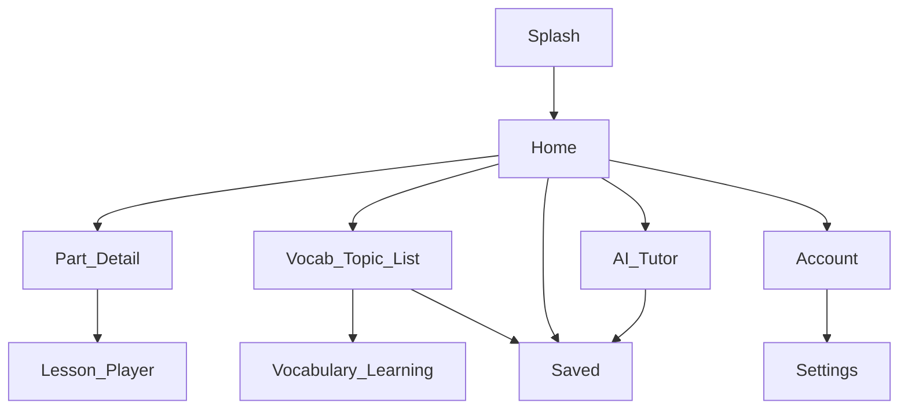
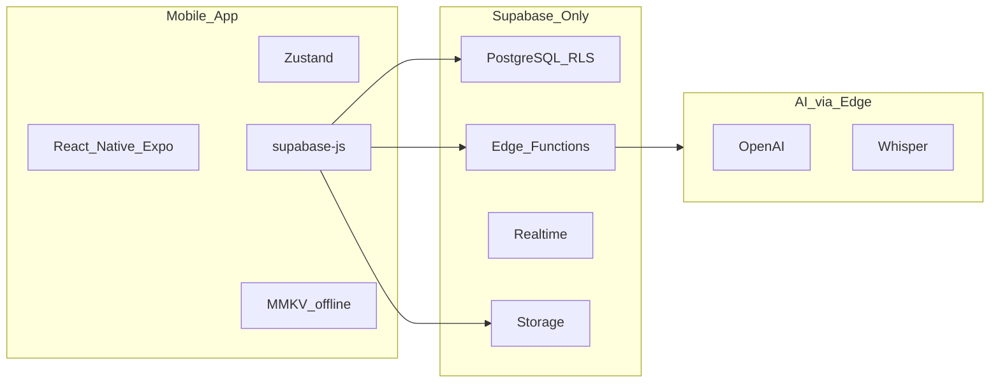

# UI/UX System Design — Cuder Học Tiếng

> **SSOT UI/UX** · English workplace communication · Mobile-first · AI-assisted  
> **Tham chiếu visual (archive):** [`duolingo_sys_design_ui_ux.html`](duolingo_sys_design_ui_ux.html) — layout/pattern only, không dùng brand Duolingo  
> **Mockup tham chiếu (2026-05-31):** 9 màn hình mobile — pattern LingoLand-style, brand **Cuder Học Tiếng**  
> **Bộ nhận diện (ảnh/âm thanh):** [`brand/`](../../brand/) · [`brand/AUDIO_MANIFEST.md`](../../brand/AUDIO_MANIFEST.md)  
> **Nguồn SRS:** [`docs/00_input_raw/requirement_base.md`](../00_input_raw/requirement_base.md) · **REQ map:** [`process/00_requirement_business.md`](../../process/00_requirement_business.md)  
> **Tech / API:** [`sys_design_techstack.md`](sys_design_techstack.md) · [`api_specs/api_design.md`](api_specs/api_design.md)

---

## 1. Branding & nguyên tắc

| Mục | Quy định |
|-----|----------|
| **Tên app** | **Cuder Học Tiếng** |
| **Subtitle (EN)** | *Workplace English with Cuder* |
| **Tagline (VI)** | *Học tiếng Anh mỗi ngày — cùng Cuder* |
| **Mascot** | **Cuder** (gà học) — thân thiện; đồng bộ hệ rank Gà con → Thần IELTS |
| **Assets SSOT** | [`brand/`](../../brand/) — logo, images, audio |
| **Tone** | Gamified, minimal (CTA xanh, streak, XP) |
| **Nền tảng** | Android, iOS (React Native / Expo) |
| **Auth** | Không đăng nhập — Device ID đồng bộ (SRS); Phase 2: mã 6 số |

### UX principles

1. **Context-first** — học từ/câu trong ngữ cảnh công việc, không flashcard đơn lẻ.
2. **Micro-feedback** — phản hồi ngay sau mỗi câu trả lời (đúng/sai, **SFX**, XP, streak).
3. **Minimal cognitive load** — một nhiệm vụ chính mỗi màn; navigation rõ.
4. **Light + Dark theme** — mặc định Light; hỗ trợ Dark và System (cài đặt app).
5. **Brand từ DB** — logo/màu/tên do **Admin** cấu hình; learner chỉ xem; quyền tính năng từ `app_system_config`.
6. **Mobile-first** — touch targets ≥ 44px; animation 60fps.

---

## 2. Theme system (Light & Dark)

### 2.1 Chế độ

| Mode | Mặc định | Ghi chú |
|------|----------|---------|
| **Light** | Có (default) | Nền sáng, đọc ban ngày |
| **Dark** | Tuỳ chọn | Nền tối, giảm chói ban đêm |
| **System** | Tuỳ chọn | Theo OS (implement sau) |

### 2.2 Semantic tokens

| Token | Light | Dark | Dùng cho |
|-------|-------|------|----------|
| `background.primary` | `#FFFFFF` | `#1A1A1A` | Màn chính, card nền |
| `background.secondary` | `#F5F5F5` | `#2A2A2A` | Section, input bg |
| `text.primary` | `#1A1A1A` | `#F5F5F5` | Tiêu đề, nội dung chính |
| `text.secondary` | `#5C5C5C` | `#A0A0A0` | Mô tả phụ |
| `text.tertiary` | `#888780` | `#6B6B6B` | Label, hint |
| `border.primary` | `#D4D4D4` | `#404040` | Viền card |
| `border.tertiary` | `#E8E8E8` | `#333333` | Divider mảnh |

### 2.3 Brand colors (không đổi theo theme)

> **Nguồn mockup:** palette trích từ 9 màn tham chiếu (2026-05-31). Token cũ Duolingo (`#58CC02`) được thay bằng green thực tế mockup.

| Token | Hex | Vai trò | Ghi chú mockup |
|-------|-----|---------|----------------|
| `brand.primary` | `#27AE60` | Header, CTA chính, active tab, progress | Home, Account, Settings |
| `brand.primary.dark` | `#1B8E3D` | Header Part detail, pressed state | Part 1 list |
| `brand.primary.light` | `#E8F5E9` | Tag bg, chip inactive bg | «2026 Format», filter chip |
| `brand.primary.text` | `#1A8D44` | Icon, sub-label xanh trong card | Settings status text |
| `accent.blue` | `#0085E5` | CTA phụ «Học từ mới», learned icon | Vocabulary list |
| `accent.orange` | `#FF9F43` | Nâng cấp, mục tiêu chart, premium crown | Account upgrade, goal line |
| `accent.orange.gradient` | `#FFA500` → `#FFD700` | Crown premium trên bài khóa | Part 1 lesson 04+ |
| `error.red` | `#FF4B4B` | Sai, danger | Feedback |
| `error.red.pressed` | `#791F1F` | Border-bottom nút wrong | Gamified depth |
| `xp.amber` | `#FFC800` | XP, achievements | Gamification |
| `status.correct` | `#27AE60` | Đúng / Đã học | Stats legend |
| `status.wrong` | `#FF4B4B` | Sai | Stats legend |
| `status.pending` | `#9E9E9E` | Chưa làm | Lesson card status |

**Dark theme (Gia sư AI):**

| Token | Hex | Vai trò |
|-------|-----|---------|
| `dark.background` | `#0B0E14` | Nền chat AI |
| `dark.surface` | `#1A2421` | Suggestion card |
| `dark.accent` | `#2ECC71` | Icon, border input, text card |

### 2.3.1 Surface & background (Light)

| Token | Hex | Dùng cho |
|-------|-----|----------|
| `surface.page` | `#F8F9FA` | Home, Account scroll bg |
| `surface.page.alt` | `#F0F4F8` | Part list, Settings bg |
| `surface.page.cool` | `#F5F7F9` | Settings variant |
| `surface.card` | `#FFFFFF` | Card, list item, bottom nav |
| `surface.header` | `brand.primary` | Sticky header xanh |
| `text.onPrimary` | `#FFFFFF` | Title trên header xanh |
| `text.primary` | `#000000` | Tiêu đề card, tên user |
| `text.secondary` | `#4A4A4A` | Definition, mô tả phụ |
| `text.muted` | `#757575` | Status «Chưa làm», hint |
| `text.inactive` | `#9E9E9E` | Bottom nav inactive |
| `progress.track` | `#D5F5E3` | Thanh progress nền |

### 2.7 Brand động & quyền (FN-15 — Admin only)

**Learner:** chỉ **đọc** `app_brand_config` + `app_system_config` — **không** UI sửa logo/màu trong Cài đặt.

**Admin:** sửa logo, màu chủ đạo, tên brand, feature flags qua **Admin portal** (phase sau) hoặc **Supabase Dashboard** (MVP).

| Token runtime | Nguồn | Ai sửa |
|---------------|-------|--------|
| `brand.primary` | `app_brand_config.brand_primary_hex` | **Admin** |
| `brand.primary.light` | `brand_primary_light_hex` | **Admin** |
| `brand.displayName` | `app_brand_config.brand_name` | **Admin** |
| `brand.logoUri` | `logo_url` / Storage `brand-assets/` | **Admin** upload |
| `permissions.*` | `app_system_config.permissions` | **Admin** |

**Preset màu (Admin portal):** Cuder xanh `#27AE60` · Biển `#0085E5` · Cam `#FF9F43` · Tím `#8E44AD` · tuỳ chỉnh `#RRGGBB`.

**Implement learner app:** fetch GET brand + permissions → cache → `ThemeContext` + ẩn menu theo flag.

**RLS:** `is_app_admin()` — xem [`supabase/ADMIN_BRAND.md`](../../supabase/ADMIN_BRAND.md).

### 2.8 Màn Admin (phase sau — không trong app learner)

| Màn | Chức năng |
|-----|-----------|
| **Đăng nhập admin** | Email/password Supabase Auth + có dòng `app_admins` |
| **Brand** | Upload logo, đổi tên/tagline, color picker màu chủ đạo |
| **Quyền hệ thống** | Toggle: vocab CRUD, quick capture, AI tutor, social, web sync |

MVP: cấu hình qua Supabase Table Editor + Storage (không build UI admin).

### 2.6 Bảng màu tóm tắt (copy nhanh)

| Nhóm | Màu | Hex |
|------|-----|-----|
| **Primary** | Green main | `#27AE60` |
| | Green dark (header Part) | `#1B8E3D` |
| | Green light (chip bg) | `#E8F5E9` |
| | Green text accent | `#1A8D44` / `#1A8A44` |
| **Accent** | Blue CTA | `#0085E5` |
| | Orange upgrade/goal | `#FF9F43` |
| | Amber XP | `#FFC800` |
| **Neutral** | Page bg | `#F8F9FA` / `#F0F4F8` |
| | Card white | `#FFFFFF` |
| | Text black | `#000000` |
| | Text grey | `#4A4A4A` / `#757575` / `#9E9E9E` |
| **Status** | Correct | `#27AE60` |
| | Wrong | `#FF4B4B` |
| | Pending | `#9E9E9E` |
| **Dark (AI)** | Background | `#0B0E14` |
| | Surface | `#1A2421` |
| | Accent | `#2ECC71` |

### 2.4 Semantic surfaces (chips, feedback)

| Vai trò | Light bg | Light text/border | Dark bg | Dark text |
|---------|----------|-------------------|---------|-----------|
| Success / Good | `#EAF3DE` | `#3B6D11` / `#C0DD97` | `#2D4A1A` | `#A8D080` |
| Info / Easy | `#E6F1FB` | `#185FA5` / `#B5D4F4` | `#1A3A5C` | `#8BB8E8` |
| Warning / Hard | `#FAEEDA` | `#854F0B` / `#FAC775` | `#4A3A15` | `#FAC775` |
| Error / Again | `#FCEBEB` | `#A32D2D` | `#4A2020` | `#F5A8A8` |
| Coral (AI accent) | `#FAECE7` | `#993C1D` | `#3D281F` | `#E8A090` |

### 2.5 Gợi ý implement (React Native)

```typescript
// themes/colors.ts — ví dụ (mockup-aligned)
export const brand = {
  primary: '#27AE60',
  primaryDark: '#1B8E3D',
  primaryLight: '#E8F5E9',
  primaryText: '#1A8D44',
  blue: '#0085E5',
  orange: '#FF9F43',
  error: '#FF4B4B',
  xp: '#FFC800',
};
export const surface = {
  page: '#F8F9FA',
  pageAlt: '#F0F4F8',
  card: '#FFFFFF',
};
export const dark = {
  background: '#0B0E14',
  surface: '#1A2421',
  accent: '#2ECC71',
};
export const light = { background: { primary: '#FFFFFF', secondary: '#F5F5F5' }, /* ... */ };
```

---

## 3. Design tokens

### 3.1 Typography

**Font family (ưu tiên):**

| Thứ tự | Font | Ghi chú |
|--------|------|---------|
| 1 | **Be Vietnam Pro** | Tiếng Việt + Latin; rounded, friendly — khuyến nghị bundle |
| 2 | **Inter** | Fallback Latin; geometric |
| 3 | System | SF Pro (iOS) / Roboto (Android) khi không bundle |

**Style scale (mockup-aligned):**

| Token | Size | Weight | Line-height | Dùng cho |
|-------|------|--------|-------------|----------|
| `display` | 22px | 700 | 1.25 | Tên user, tiêu đề profile |
| `heading1` | 20px | 600 | 1.3 | Header màn («Cài đặt», «Đã lưu»), section «Luyện Nghe» |
| `heading2` | 18px | 600 | 1.35 | Từ tiếng Anh trong list, nút «Học từ mới» |
| `heading3` | 16px | 600 | 1.4 | Card title («Photographs 01», «Luyện Part 1») |
| `body` | 14px | 400 | 1.6 | Definition, card text, chat bubble |
| `body.medium` | 14px | 500 | 1.5 | Button trong practice card |
| `caption` | 12px | 400 | 1.4 | Tag «2026 Format», bottom nav label |
| `caption.bold` | 12px | 600 | 1.3 | Status «Chưa làm», filter chip |
| `label` | 11px | 500 | 1.2 | Section label uppercase (letter-spacing 0.08em) |

**Màu chữ theo ngữ cảnh:**

| Ngữ cảnh | Token màu |
|----------|-----------|
| Từ tiếng Anh (vocab list) | `brand.primary` |
| Nghĩa / loại từ | `text.secondary` |
| Trên header xanh | `text.onPrimary` |
| Nav active | `brand.primary` |
| Nav inactive | `text.inactive` |

**Load font (Expo):**

```typescript
// app/_layout.tsx — ví dụ
import { useFonts, BeVietnamPro_400Regular, BeVietnamPro_600SemiBold, BeVietnamPro_700Bold } from '@expo-google-fonts/be-vietnam-pro';

const [loaded] = useFonts({
  BeVietnamPro_400Regular,
  BeVietnamPro_600SemiBold,
  BeVietnamPro_700Bold,
});
// fontFamily: 'BeVietnamPro_600SemiBold' cho heading; _400Regular cho body
```

### 3.2 Spacing scale

`4` · `8` · `12` · `16` · `24` · `32` px

### 3.3 Border radius

| Token | Value | Dùng cho |
|-------|-------|----------|
| `radius.sm` | 8px | Button «Thử lại», chip nhỏ |
| `radius.md` | 12px | Input AI chat, suggestion card |
| `radius.lg` | 16px | Practice card button, progress pill |
| `radius.xl` | 20px | Lesson card, filter chip |
| `radius.2xl` | 24–30px | Settings card, content sheet overlap header |
| `radius.full` | 9999px | Avatar, FAB, bottom CTA pill |

### 3.4 Border & elevation

- **Card:** `border-radius: 20px`, shadow nhẹ `0 2px 8px rgba(0,0,0,0.06)` (soft UI)
- **Header curve:** content sheet `border-top-left/right-radius: 24px` chồng lên header xanh
- **Nút primary:** bo tròn lớn (pill), full-width hoặc inline; gradient xanh cho «Nâng Cấp»
- **Bottom nav:** nền trắng, không shadow nặng; active = icon + label `brand.primary` + optional dot trên icon

---

## 4. Screen inventory & flows

### 4.1 Danh sách màn (đầy đủ — mockup 2026-05-31)

| # | Màn hình | Route gợi ý | Tab | REQ / FN | Trạng thái mockup |
|---|----------|---------------|-----|----------|-------------------|
| 1 | **Splash** | `/` | — | — | Chưa có mockup |
| 2 | **Home — Trang chủ** | `/home` | Trang chủ | FN-10 | ✅ |
| 3 | **Part Detail — Danh sách bài** | `/practice/:partId` | — | FN-06, FN-10 | ✅ Part 1 |
| 4 | **Vocabulary — Chủ đề từ** | `/vocab/:topicId` | Từ vựng | FN-01, FN-02 | ✅ Hợp Đồng |
| 5 | **Vocabulary Learning** | `/learn/vocab/:lessonId` | — | FN-01, FN-05 | Wireframe text |
| 6 | **Saved — Đã lưu** | `/saved` | Đã lưu | FN-04 | ✅ empty state |
| 7 | **AI Tutor — Gia sư AI** | `/tutor` | Gia sư AI | FN-07 | ✅ Emma chat |
| 8 | **Account — Tài khoản** | `/account` | Tài khoản | FN-10 | ✅ profile + stats |
| 9 | **Settings — Cài đặt** | `/settings` | — | FN-11 | ✅ |
| 10 | **Context Review** | `/learn/review` | — | FN-06 | Wireframe text |
| 11 | **Speaking Practice** | `/learn/speaking` | — | FN-08, FN-09 | Wireframe text |
| 12 | **Collection** | `/collections` | — | FN-04 | Map → Đã lưu |
| 13 | **Progress Dashboard** | `/progress` | — | FN-10 | Gộp vào Account |

**Out of scope MVP:** Login, Sign up — đồng bộ qua Device ID.

### 4.2 Bottom navigation (5 tab — SSOT)

| Tab | Icon | Route | Active color |
|-----|------|-------|--------------|
| **Trang chủ** | Home (outline) | `/home` | `brand.primary` |
| **Gia sư AI** | Sparkle / stars | `/tutor` | `brand.primary` |
| **Đã lưu** | Bookmark + plus | `/saved` | `brand.primary` |
| **Từ vựng** | Open book | `/vocab` | `brand.primary` |
| **Tài khoản** | User profile | `/account` | `brand.primary` + dot indicator |

- Nền: `surface.card` (`#FFFFFF`)
- Inactive: icon + label `text.inactive`
- Chiều cao touch target ≥ 44px; label `caption`

### 4.3 Navigation flow



### 4.4 Chi tiết từng màn hình (mockup spec)

---

#### 4.4.1 Home — Trang chủ (`/home`)

**Mục đích:** Hub luyện tập — chia Listening / Reading (hoặc Workplace topics tương đương).

| Vùng | Thành phần | Style |
|------|------------|-------|
| **Top bar** | Logo **Cuder Học Tiếng** (wordmark xanh + mascot Cuder) | `brand.primary` text |
| | Icons: premium diamond, bell, history clock | Phải header |
| **Greeting row** | Avatar tròn + «Xin chào» + tên user (bold) | `display` tên |
| | Nút **Nâng Cấp** | Gradient `#27AE60` → `#A8E6CF`, text trắng, `radius.lg` |
| **Section** | «Luyện Nghe» / «Luyện Đọc» (hoặc topic workplace) | `heading1`, đen |
| **Practice grid** | 2 cột; card trắng `radius.xl`, shadow nhẹ | |
| | Title: «Luyện Part N» | `heading3` |
| | Sub-button: nền `#E9F7EF`, text `#27AE60` + icon | «Mô Tả Hình Ảnh», «Đoạn Hội Thoại»… |
| **FAB** | Pencil grey (feedback/notes) | Phải màn, semi-transparent |
| **Bottom nav** | Tab Trang chủ **active** | |

**Interaction:** Tap card Part → `/practice/:partId`. Tap Nâng Cấp → paywall modal.

---

#### 4.4.2 Part Detail — Danh sách bài (`/practice/:partId`)

**Ví dụ mockup:** Part 1 — Photographs.

| Vùng | Thành phần | Style |
|------|------------|-------|
| **Header** | Nền `#1B8E3D`, back arrow trắng, title «Part 1» center | `heading1`, `text.onPrimary` |
| | Bo cong lớn phía dưới header → content | `radius.2xl` overlap |
| **Background** | `#F0F4F8` | `surface.page.alt` |
| **Lesson card** | Trắng, `radius.xl`, padding 16px | |
| | Title: «Photographs 01» | `heading3` |
| | Crown icon (premium) | `accent.orange.gradient` — bài 04+ |
| | Tag pill: «2026 Format» | bg `#E8F5E9`, text `#1B8E3D`, `caption.bold` |
| | Status: icon checklist + «Chưa làm» | `text.muted` |
| | Clock icon (lịch sử) | Phải card |
| **Floating bar** | Bottom center, nền đen, text trắng | |
| | «>> Bài học đề xuất» + tên bài | Gợi ý AI/algorithm |

**States status:** «Chưa làm» (grey) · «Đang làm» · «Hoàn thành» (green).

---

#### 4.4.3 Vocabulary — Danh sách từ theo chủ đề (`/vocab/:topicId`)

**Ví dụ mockup:** Chủ đề «Hợp Đồng».

| Vùng | Thành phần | Style |
|------|------------|-------|
| **Header** | Nền `brand.primary`, back, icon chủ đề (ảnh trong vòng tròn), title | |
| **Progress pill** | Nền trắng trong header | |
| | «0/12 đã học» — checkmark xanh dương | `accent.blue` |
| | «0 cần luyện tập» — moon xanh lá | `brand.primary` |
| **Content sheet** | Trắng, bo trên lớn overlap header | |
| **List item** | Icon seed trong vòng dashed xanh nhạt | Trái |
| | Word EN (green bold) + POS + nghĩa VN (grey) | Giữa |
| | Save icon (floppy disk) | Phải, đen |
| **Bottom CTA** | Fixed «Học từ mới» | bg `accent.blue`, icon flashcard, text trắng `heading2` |

**Interaction:** Tap save → thêm vào Đã lưu. Tap CTA → Vocabulary Learning session.

---

#### 4.4.4 Saved — Đã lưu (`/saved`)

| Vùng | Thành phần | Style |
|------|------------|-------|
| **Header** | Title «Đã lưu» center | `heading1`, đen, không header xanh |
| **Filter chips** | Horizontal scroll | |
| | Active «Tất cả» | bg `brand.primary`, text trắng, `radius.xl` |
| | Inactive «Part 1»… | bg `brand.primary.light`, text `brand.primary.text` |
| **Empty state** | Folder icon grey | Center |
| | «Chưa có dữ liệu!» | `body` |
| | Button «Thử lại» | `brand.primary` bg, text trắng |
| **FAB** | Pencil edit | Phải, grey semi-transparent |
| **Bottom nav** | Tab Đã lưu **active** | |

**Filled state (khi có data):** List card tương tự Part Detail hoặc vocab item; filter theo Part/topic.

---

#### 4.4.5 AI Tutor — Gia sư AI (`/tutor`)

**Theme:** Dark (space) — khác biệt so với các màn Light.

| Vùng | Thành phần | Style |
|------|------------|-------|
| **Header** | «Gia sư AI» trái | Trắng, `heading1` |
| | History/clock icon phải | `dark.accent` circle |
| **Hero** | Avatar Cuder + speech bubble trắng | |
| | Greeting intro (EN + VI) | `body` trong bubble |
| | Rocket illustration nền | `dark.background` `#0B0E14` |
| **Suggestions** | Grid 2×2 card | bg `dark.surface` `#1A2421`, `radius.md` |
| | «Chụp hình câu hỏi» + camera icon | |
| | 3 prompt gợi ý TOEIC/workplace | Text `dark.accent` |
| **Input bar** | Camera icon trái | Trắng |
| | Text field border `dark.accent` | Placeholder grey |
| | Send icon trong field | `dark.accent` |
| **Bottom nav** | Tab Gia sư AI **active** | Nền trắng (nav luôn light) |

**REQ map:** FN-07 AI Conversation; scenario có thể preset qua suggestion cards.

---

#### 4.4.6 Account — Tài khoản (`/account`)

**Layout:** Scroll dọc, nhiều card trắng trên `surface.page`.

| Vùng | Thành phần | Style |
|------|------------|-------|
| **Top actions** | «Cài đặt» + gear icon | Phải trên |
| **Profile** | Avatar tròn (illustration) | |
| | Tên user `display` | «Nguyễn Phi Long» |
| | Username + copy icon xanh | `caption` |
| | **Nâng Cấp** button | bg `accent.orange` `#FF9F43`, crown icon trắng |
| **Thống kê** | Dropdown «Thống kê: 7 ngày gần nhất» | |
| **Điểm ước tính card** | Vòng tròn progress xanh + số giữa | |
| | Nghe: headphone + «5 / 495» + progress bar | |
| | Đọc: document + «5 / 495» + progress bar | Track `#D5F5E3` |
| **Thời gian học gần đây** | Title + legend (Đã học = green, Mục tiêu = orange) | |
| | Line chart 7 ngày (CN → Hôm nay) | Orange goal line @ 30 phút |
| | CTA «Đặt mục tiêu thời gian» | Full-width green pill |
| **Tổng thể** | Legend Đúng/Sai/Chưa làm (green/red/grey) | |
| | CTA «Xem lịch sử học» | Full-width green pill |
| **Bottom nav** | Tab Tài khoản **active** + green dot | |

---

#### 4.4.7 Settings — Cài đặt (`/settings`)

| Vùng | Thành phần | Style |
|------|------------|-------|
| **Header** | Xanh `#1A8D44`, back, «Cài đặt» center trắng | |
| **Background** | `#F0F4F8` / `#F5F7F9` | |
| **Section title** | «Tài khoản», «Giao diện», «Thông báo», «Luyện tập» | `heading1` đen, ngoài card |
| **Card** | Trắng `radius.2xl`, items trong card | |
| **Tài khoản** | Profile row: avatar + name + «Xem thông tin» grey | |
| | «Nâng cấp» — ribbon icon xanh | |
| | «Lịch sử mua hàng» — clock icon xanh | |
| **Giao diện** | «Chế độ sáng / tối / hệ thống» | 3 nút segment — **learner only** |
| | «Ngôn ngữ mẹ đẻ» → «Tiếng Việt» green | |
| | *(Không có)* «Màu thương hiệu» / logo | FN-15 — **admin only**, không trong Cài đặt learner |
| **Âm thanh** | «Âm thanh học tập» toggle (SFX đúng/sai) | |
| | «Âm thanh nhắc nhở» toggle (FN-11) | |
| **Thông báo** | «Nhắc nhở luyện tập hằng ngày» + bell | Sub «Chưa thiết lập» green |
| **Luyện tập** | «Cấu hình luyện tập» + dumbbell icon | |

**REQ map:** FN-11 notification + âm thanh; theme Light/Dark → §2.1. Brand/quyền → §2.7 (admin).

---

#### 4.4.8 Màn bổ sung (wireframe text — chưa mockup)

**Splash**

- Center: mascot Cuder + wordmark **Cuder Học Tiếng**
- Tagline: *Học tiếng Anh mỗi ngày — cùng Cuder*
- Primary CTA: **BẮT ĐẦU HỌC** → Home

**Vocabulary Learning**

- Lesson header + progress bar segment xanh
- Flashcard: word, IPA, context, meaning
- SR actions: Again · Hard · Good · Easy

**Context Review**

- Đoạn highlight từ target
- Ô nhập / chọn đáp án

**Speaking Practice**

- Câu mẫu + mic lớn xanh
- Waveform + score panel (Pronunciation, Fluency, Accuracy)

---

## 5. Component library

### 5.1 Buttons

| Variant | Background | Text | Border / shadow | Dùng cho |
|---------|------------|------|---------------|----------|
| **Primary** | `brand.primary` `#27AE60` | `#FFFFFF` | — | Thử lại, Đặt mục tiêu, Xem lịch sử |
| **Primary Blue** | `accent.blue` `#0085E5` | `#FFFFFF` | — | Học từ mới |
| **Upgrade** | `accent.orange` `#FF9F43` | `#FFFFFF` | crown icon | Nâng Cấp (Account) |
| **Upgrade Gradient** | `#27AE60` → `#A8E6CF` | `#FFFFFF` | horizontal gradient | Nâng Cấp (Home) |
| **Secondary** | `background.secondary` | `text.primary` | — | Bỏ qua, Huỷ |
| **Correct** | `#EAF3DE` | `#3B6D11` | — | Đáp án đúng |
| **Wrong** | `#FCEBEB` | `#A32D2D` | — | Đáp án sai |
| **Floating Suggest** | `#000000` | `#FFFFFF` | bottom center | Bài học đề xuất |

### 5.2 Cards

| Component | Spec |
|-----------|------|
| **PracticeCard** | `surface.card`, `radius.xl`, shadow `0 2px 8px rgba(0,0,0,0.06)`; title + sub-button mint |
| **LessonCard** | Như PracticeCard + tag pill + status row + optional crown |
| **SettingsCard** | `radius.2xl`, grouped list rows, divider mảnh giữa items |
| **StatCard** | Progress ring + horizontal bars; track `progress.track` |

### 5.3 Chips & filters

| Component | Active | Inactive |
|-----------|--------|----------|
| **FilterChip** | bg `brand.primary`, text white | bg `brand.primary.light`, text `brand.primary.text` |
| **FormatTag** | bg `#E8F5E9`, text `#1B8E3D` | — |
| **ProgressPill** | bg white trong header, 2 stat rows | — |

### 5.4 Navigation

| Component | Spec |
|-----------|------|
| **BottomNav** | 5 tab; height ~56px + safe area; active = green icon + label + optional dot |
| **HeaderGreen** | Full-width `brand.primary`; back trắng; title center; curve overlap content |
| **HeaderPlain** | Trắng/xám; title center đen — dùng Saved |

### 5.5 Lists

| Component | Spec |
|-----------|------|
| **VocabListItem** | Dashed circle icon + word (green) + definition (grey) + save action |
| **SettingsRow** | Icon xanh trái + label + sub-value xanh phải/dưới |

### 5.6 Empty state

| Element | Spec |
|---------|------|
| Icon | Folder outline grey ~48px |
| Message | «Chưa có dữ liệu!» — `body`, center |
| CTA | Primary button «Thử lại» |

### 5.7 AI Tutor (dark)

| Component | Spec |
|-----------|------|
| **SuggestionCard** | bg `dark.surface`, text `dark.accent`, `radius.md`, 2×2 grid |
| **ChatBubble AI** | White bg, dark text, avatar trái |
| **InputField** | Border `dark.accent`, camera + send icons |

### 5.8 Flashcard (Vocabulary + SR)

| Vùng | Nội dung |
|------|----------|
| Head | Word (`heading2`/600), IPA + part of speech |
| Context | Câu ví dụ trong card |
| Meaning | Nghĩa tiếng Việt (`brand.primary`) |
| Actions | **Again** · **Hard** · **Good** · **Easy** (4 nút ngang, màu semantic) |

### 5.9 Charts (Account)

| Chart | Spec |
|-------|------|
| **StudyTimeLine** | X: 7 ngày; Y: phút; green = đã học, orange = mục tiêu (30 phút default) |
| **ScoreRing** | Circular progress `brand.primary`, số overall giữa |
| **SkillBar** | Nghe/Đọc horizontal bar, fill `brand.primary` on track `progress.track` |

---

## 6. System architecture (UI layer)



| Khối | UI-relevant |
|------|-------------|
| **Mobile** | Screens, theme, `supabase-js`, offline queue |
| **Supabase PostgREST** | CRUD vocab, collections, sentences |
| **Supabase Edge** | Schedule, review SRS, chat, STT, pronunciation |
| **Storage** | Audio upload speaking |

Chi tiết API → §7 (UI triggers); contract đầy đủ → [`api_specs/api_design.md`](api_specs/api_design.md). Module code → `src/fn**/`.

---

## 7. API & Gamification (UI-facing)

### 7.1 Key endpoints (hiển thị / loading states)

| Method | Path | UI trigger |
|--------|------|------------|
| GET | `/vocabularies` | List từ, Home |
| POST | `/vocabularies` | Thêm từ (FN-02) |
| PUT | `/vocabularies/:id` | Sửa từ |
| DELETE | `/vocabularies/:id` | Xóa từ |
| GET | `/learning/schedule` | Home «Việc hôm nay» |
| POST | `/learning/review` | Submit Again/Hard/Good/Easy |
| POST | `/conversation/start` | AI Chat mở session |
| POST | `/conversation/message` | Gửi tin chat |
| POST | `/speech-to-text` | Speaking — sau ghi âm |
| POST | `/pronunciation-score` | Hiển thị điểm speaking |

### 7.2 Gamification UI

| Element | Hiển thị | Điều kiện (SRS) |
|---------|----------|-----------------|
| Daily streak | `🔥 7` | Học liên tục N ngày |
| XP | `⭐ 480` | Sau mỗi bài/review |
| Level | `B1` | Ngưỡng XP |
| Words learned | `42` | Counter tổng |
| Achievements | Chip badge | 7-day streak, 100 words, first conversation, speaking master |

Achievement **locked:** opacity 50%, chip gray.

---

## 8. Performance, security & NFR (UI)

| Nhóm | Yêu cầu | Ảnh hưởng UI |
|------|---------|---------------|
| **Performance** | Startup &lt; 3s | Splash nhẹ; skeleton Home |
| | API &lt; 500ms | Loading spinner trên card |
| | 60fps | Animated progress, không jank |
| | Offline learning | Cache từ/schedule; banner «Đang offline» |
| **Security** | HTTPS | — |
| | Device ID | Không màn login |
| | Không PII nhạy cảm | — |
| **Availability** | 99.5% | Error state + retry CTA |
| **Scale** | Modular | Theme + components tách file |

---

## 9. REQ ↔ Screen ↔ Module map

| REQ | FN | Màn hình chính (mockup) | Spec |
|-----|-----|-------------------------|------|
| REQ-01 | FN-01 | Vocab Topic List + Vocabulary Learning | [`src/fn01_hoc_tu_vung_ngu_canh/01_requirement.md`](../../src/fn01_hoc_tu_vung_ngu_canh/01_requirement.md) |
| REQ-02 | FN-02 | Save icon trên Vocab list | `src/fn02_quan_ly_tu_vung_ca_nhan/` |
| REQ-03 | FN-03 | Trong Collection / lesson context | `src/fn03_quan_ly_cau_giao_tiep/` |
| REQ-04 | FN-04 | **Đã lưu** (`/saved`) | `src/fn04_learning_collection/` |
| REQ-05 | FN-05 | SR trên Vocabulary Learning | `src/fn05_spaced_repetition/` |
| REQ-06 | FN-06 | Part Detail + Context Review | `src/fn06_context_review/` |
| REQ-07 | FN-07 | **Gia sư AI** (`/tutor`) | `src/fn07_ai_conversation/` |
| REQ-08 | FN-08 | Speaking Practice | `src/fn08_speech_to_text/` |
| REQ-09 | FN-09 | Score panel trên Speaking | `src/fn09_pronunciation_scoring/` |
| REQ-10 | FN-10 | **Home** + **Tài khoản** | `src/fn10_dashboard_hoc_tap/` |
| REQ-11 | FN-11 | **Cài đặt** — nhắc + âm thanh | `src/fn11_notification_reminder/` |
| REQ-15 | FN-15 | **Cài đặt → Giao diện** — màu brand | *(shell Settings + theme)* |

**BDD:** `docs/01_specification/features/*.feature` — đồng bộ AC với từng màn.

---

## 10. Âm thanh & bộ nhận diện

### 10.1 Thư mục SSOT

```text
brand/
├── logo/           # wordmark, app icon nguồn, mascot Cuder
├── images/         # rank badges, empty state, illustration
└── audio/
    ├── sfx/        # answer_correct, answer_wrong, xp_gain…
    └── reminder/   # reminder_default, reminder_gentle…
```

Chi tiết file: [`brand/AUDIO_MANIFEST.md`](../../brand/AUDIO_MANIFEST.md) · Bundle app: `apps/mobile/assets/brand/`

### 10.2 SFX — đáp án đúng / sai

| Sự kiện | File | UX |
|---------|------|-----|
| Chọn đúng | `answer_correct.mp3` | Phát đồng thời highlight xanh + optional `xp_gain` |
| Chọn sai | `answer_wrong.mp3` | Phát đồng thời highlight đỏ; cho phép thử lại |
| Streak / hoàn bài | `streak_tick.mp3` | Celebration ngắn |

**Component:** gọi `playAnswerCorrect()` / `playAnswerWrong()` từ [`soundFeedback.ts`](../../apps/mobile/src/services/soundFeedback.ts) sau tap đáp án.

### 10.3 Reminder audio (FN-11)

| Biến thể | File | Khi |
|----------|------|-----|
| Mặc định | `reminder_default.mp3` | Mốc nhắc ngắt quãng |
| Nhẹ | `reminder_gentle.mp3` | User chọn trong Settings |
| Khẩn | `reminder_urgent.mp3` | Streak at risk |

### 10.4 Cài đặt âm thanh (Settings)

| Toggle | Mặc định |
|--------|----------|
| Âm thanh học tập | Bật |
| Âm thanh nhắc nhở | Bật |
| Rung khi đúng/sai | Tuỳ chọn (mobile) |

---

## 11. Lịch sử

| Ngày | Thay đổi |
|------|----------|
| 2026-05-31 | FN-15 cấu hình brand (màu Settings; tên DB ẩn UI phase sau) |
| 2026-05-31 | Rebrand **Cuder Học Tiếng**; §10 âm thanh + `brand/` |
| 2026-05-31 | Bổ sung 9 màn mockup; palette; font Be Vietnam Pro; bottom nav 5 tab |
| 2026-05-28 | Tạo SSOT; Light + Dark theme; Splash → Home |
