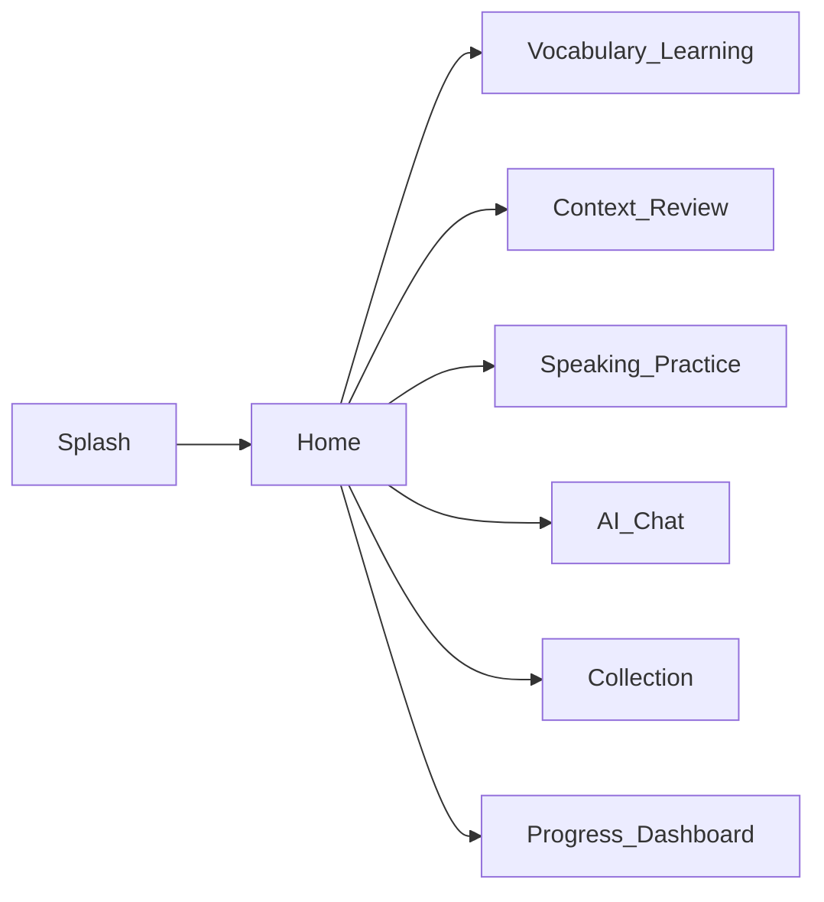
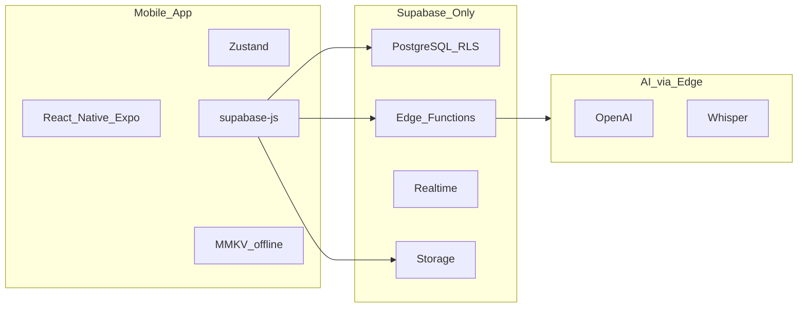

# UI/UX System Design — Học cùng Bee

> **SSOT UI/UX** · English workplace communication · Mobile-first · AI-assisted  
> **Tham chiếu visual (archive):** [`duolingo_sys_design_ui_ux.html`](duolingo_sys_design_ui_ux.html) — layout/pattern only, không dùng brand Duolingo  
> **Nguồn SRS:** [`docs/00_input_raw/requirement_base.md`](../00_input_raw/requirement_base.md) · **REQ map:** [`process/00_requirement_business.md`](../../process/00_requirement_business.md)  
> **Tech / API:** [`sys_design_techstack.md`](sys_design_techstack.md) · [`api_specs/api_design.md`](api_specs/api_design.md)

---

## 1. Branding & nguyên tắc

| Mục | Quy định |
|-----|----------|
| **Tên app** | **Học cùng Bee** |
| **Subtitle (EN)** | *Workplace English with Bee* |
| **Mascot** | Bee (ong) — thân thiện, khích lệ học mỗi ngày |
| **Tone** | Gamified, minimal, Duolingo-**inspired** (CTA xanh, streak, XP) — **không** copy logo/copy đối thủ |
| **Nền tảng** | Android, iOS (React Native / Expo) |
| **Auth** | Không đăng nhập — Device ID đồng bộ (SRS) |

### UX principles

1. **Context-first** — học từ/câu trong ngữ cảnh công việc, không flashcard đơn lẻ.
2. **Micro-feedback** — phản hồi ngay sau mỗi câu trả lời (đúng/sai, XP, streak).
3. **Minimal cognitive load** — một nhiệm vụ chính mỗi màn; navigation rõ.
4. **Light + Dark theme** — mặc định Light; hỗ trợ Dark và System (cài đặt app).
5. **Mobile-first** — touch targets ≥ 44px; animation 60fps.

---

## 2. Theme system (Light & Dark)

### 2.1 Chế độ

| Mode | Mặc định | Ghi chú |
|------|----------|---------|
| **Light** | Có (default) | Nền sáng, đọc ban ngày |
| **Dark** | Tuỳ chọn | Nền tối, giảm chói ban đêm |
| **System** | Tuỳ chọn | Theo OS (implement sau) |

### 2.2 Semantic tokens

| Token | Light | Dark | Dùng cho |
|-------|-------|------|----------|
| `background.primary` | `#FFFFFF` | `#1A1A1A` | Màn chính, card nền |
| `background.secondary` | `#F5F5F5` | `#2A2A2A` | Section, input bg |
| `text.primary` | `#1A1A1A` | `#F5F5F5` | Tiêu đề, nội dung chính |
| `text.secondary` | `#5C5C5C` | `#A0A0A0` | Mô tả phụ |
| `text.tertiary` | `#888780` | `#6B6B6B` | Label, hint |
| `border.primary` | `#D4D4D4` | `#404040` | Viền card |
| `border.tertiary` | `#E8E8E8` | `#333333` | Divider mảnh |

### 2.3 Brand colors (không đổi theo theme)

| Tên | Hex | Vai trò |
|-----|-----|---------|
| Primary Green | `#58CC02` | CTA, active, streak done, nút chính |
| Primary Green (pressed) | `#46A302` | Border-bottom 3D nút primary |
| Accent Blue | `#1CB0F6` | Info, link, Easy SR |
| Error Red | `#FF4B4B` | Sai, danger |
| Error Red (pressed) | `#791F1F` | Border-bottom nút wrong |
| XP Amber | `#FFC800` | XP, achievements |

### 2.4 Semantic surfaces (chips, feedback)

| Vai trò | Light bg | Light text/border | Dark bg | Dark text |
|---------|----------|-------------------|---------|-----------|
| Success / Good | `#EAF3DE` | `#3B6D11` / `#C0DD97` | `#2D4A1A` | `#A8D080` |
| Info / Easy | `#E6F1FB` | `#185FA5` / `#B5D4F4` | `#1A3A5C` | `#8BB8E8` |
| Warning / Hard | `#FAEEDA` | `#854F0B` / `#FAC775` | `#4A3A15` | `#FAC775` |
| Error / Again | `#FCEBEB` | `#A32D2D` | `#4A2020` | `#F5A8A8` |
| Coral (AI accent) | `#FAECE7` | `#993C1D` | `#3D281F` | `#E8A090` |

### 2.5 Gợi ý implement (React Native)

```typescript
// themes/colors.ts — ví dụ
export const light = { background: { primary: '#FFFFFF', secondary: '#F5F5F5' }, /* ... */ };
export const dark  = { background: { primary: '#1A1A1A', secondary: '#2A2A2A' }, /* ... */ };
export const brand = { primary: '#58CC02', accent: '#1CB0F6', error: '#FF4B4B', xp: '#FFC800' };
```

---

## 3. Design tokens

### 3.1 Typography

| Style | Size | Weight | Line-height | Dùng cho |
|-------|------|--------|-------------|----------|
| Heading 1 | 24px | 500 | 1.3 | Tiêu đề màn |
| Heading 2 | 18px | 500 | 1.35 | Section header |
| Body | 14px | 400 | 1.6 | Nội dung, câu ví dụ |
| Caption | 12px | 400 | 1.4 | Label, metadata |
| Label (uppercase) | 11px | 500 | 1.2 | Section label (letter-spacing 0.08em) |

**Font:** System sans (SF Pro / Roboto) hoặc Inter khi bundle.

### 3.2 Spacing scale

`4` · `8` · `12` · `16` · `24` · `32` px

### 3.3 Border radius

| Token | Value | Dùng cho |
|-------|-------|----------|
| `radius.sm` | 6px | Chip, tag |
| `radius.md` | 8px | Button |
| `radius.lg` | 12–14px | Card, phone mock |
| `radius.xl` | 20px | Pill chip |

### 3.4 Border & elevation

- Viền mảnh: `0.5px` solid `border.tertiary`
- Nút primary/feedback: `border-bottom: 3px` màu pressed (gamified depth)
- Không shadow nặng — flat + border (minimal)

---

## 4. Screen inventory & flows

### 4.1 Danh sách màn (SRS)

| # | Màn hình | Route gợi ý | REQ / FN | Mô tả ngắn |
|---|----------|---------------|----------|------------|
| 1 | **Splash** | `/` | — | Logo Bee, «Học cùng Bee», tagline, CTA «Bắt đầu học» |
| 2 | **Home** | `/home` | FN-10 | Streak, XP, thử thách hôm nay, danh sách khóa/bộ học |
| 3 | **Vocabulary Learning** | `/learn/vocab` | FN-01, FN-05 | Flashcard ngữ cảnh, progress, SR sau bài |
| 4 | **Context Review** | `/learn/review` | FN-06 | Đoán nghĩa / điền từ trong đoạn hội thoại |
| 5 | **Speaking Practice** | `/learn/speaking` | FN-08, FN-09 | Ghi âm, waveform, so sánh phát âm, điểm |
| 6 | **AI Chat** | `/learn/chat` | FN-07 | Hội thoại AI theo scenario (Interview, Scrum…) |
| 7 | **Collection** | `/collections` | FN-04 | Danh sách bộ học, thêm từ/câu |
| 8 | **Progress Dashboard** | `/progress` | FN-10 | Streak, XP, thống kê tuần/tháng, achievements |

**Out of scope MVP:** Login, Sign up, chọn ngôn ngữ đa app — đồng bộ qua Device ID ([`requirement_base`](../00_input_raw/requirement_base.md) § Security).

### 4.2 Navigation flow



**Bottom tab (gợi ý):** Home · Học · Bộ sưu tập · Tiến độ — chi tiết trong `03_debate.md` khi implement.

### 4.3 Wireframe text (theo màn)

#### Splash

- Center: mascot Bee + wordmark **Học cùng Bee**
- Tagline: *Học tiếng Anh công việc — cùng Bee mỗi ngày*
- Primary CTA: **BẮT ĐẦU HỌC** → Home
- Không form đăng nhập

#### Home

- Header: `🔥 {streak}` · `⭐ {xp} XP`
- «Chào bạn!» + card **Thử thách hôm nay** (vd. 10 từ vựng)
- Section **Khóa / bộ học** (Workplace English, Developer Vocab…)
- Quick actions → Vocab, Review, Speaking, Chat

#### Vocabulary Learning

- Lesson header: `Bài 01 — deploy`
- Card từ: word, IPA, loại từ, câu context (nền success nhạt)
- Câu hỏi: «Nghĩa là?» + đáp án / chọn đáp án
- Progress bar 4 bước (segment xanh)

#### Context Review

- Label: Context Review
- Đoạn có **highlight** từ target (nền warning nhạt)
- Ô nhập / chọn đáp án

#### Speaking Practice

- Câu mẫu + nút mic lớn (Primary Green)
- Waveform khi ghi; transcript sau STT
- Panel điểm: Pronunciation, Fluency, Accuracy (FN-09)

#### AI Chat

- Header scenario: «Phỏng vấn kỹ thuật» / «Scrum daily»…
- Bubble AI (success surface) vs user (secondary bg)
- Input + icon mic gửi tin

#### Collection

- List card: tên bộ, số item, topic
- FAB hoặc CTA «Tạo bộ mới»
- Tap → chi tiết items (từ + câu)

#### Progress Dashboard

- Grid stat: streak, XP, words learned, level (B1…)
- Section Achievements (chip locked/unlocked)
- Biểu đồ tuần (optional phase 2)

---

## 5. Component library

### 5.1 Buttons

| Variant | Background | Text | Border-bottom | Dùng cho |
|---------|------------|------|---------------|----------|
| **Primary** | `#58CC02` | `#FFFFFF` | `#46A302` | Bắt đầu học, Submit |
| **Secondary** | `background.secondary` | `text.primary` | — | Bỏ qua, Huỷ |
| **Correct** | `#EAF3DE` / dark success | `#3B6D11` | `#27500A` | Đáp án đúng |
| **Wrong** | `#FCEBEB` / dark error | `#A32D2D` | `#791F1F` | Đáp án sai |

### 5.2 Flashcard (Vocabulary + SR)

| Vùng | Nội dung |
|------|----------|
| Head | Word (18px/500), IPA + part of speech |
| Context | Câu ví dụ italic trong card |
| Meaning | Nghĩa tiếng Việt (màu success) |
| Actions | **Again** · **Hard** · **Good** · **Easy** (4 nút ngang, màu semantic) |

### 5.3 Chips & stats

- **Chip:** pill `radius 20px`, dot màu + label (Mobile-first, AI-assisted…)
- **Stat card:** `background.secondary`, số lớn + label caption (streak, XP…)

### 5.4 Chat bubbles

| Loại | Style |
|------|--------|
| AI (Bee) | `success` surface, bo góc `0 8px 8px 8px` |
| User | `background.secondary`, bo góc `8px 0 8px 8px`, lề trái |

### 5.5 Header học tập

- Streak chip: `🔥 {n}` (success chip)
- XP: `⭐ {n} XP` (màu amber)

---

## 6. System architecture (UI layer)



| Khối | UI-relevant |
|------|-------------|
| **Mobile** | Screens, theme, `supabase-js`, offline queue |
| **Supabase PostgREST** | CRUD vocab, collections, sentences |
| **Supabase Edge** | Schedule, review SRS, chat, STT, pronunciation |
| **Storage** | Audio upload speaking |

Chi tiết API → §7 (UI triggers); contract đầy đủ → [`api_specs/api_design.md`](api_specs/api_design.md). Module code → `src/fn**/`.

---

## 7. API & Gamification (UI-facing)

### 7.1 Key endpoints (hiển thị / loading states)

| Method | Path | UI trigger |
|--------|------|------------|
| GET | `/vocabularies` | List từ, Home |
| POST | `/vocabularies` | Thêm từ (FN-02) |
| PUT | `/vocabularies/:id` | Sửa từ |
| DELETE | `/vocabularies/:id` | Xóa từ |
| GET | `/learning/schedule` | Home «Việc hôm nay» |
| POST | `/learning/review` | Submit Again/Hard/Good/Easy |
| POST | `/conversation/start` | AI Chat mở session |
| POST | `/conversation/message` | Gửi tin chat |
| POST | `/speech-to-text` | Speaking — sau ghi âm |
| POST | `/pronunciation-score` | Hiển thị điểm speaking |

### 7.2 Gamification UI

| Element | Hiển thị | Điều kiện (SRS) |
|---------|----------|-----------------|
| Daily streak | `🔥 7` | Học liên tục N ngày |
| XP | `⭐ 480` | Sau mỗi bài/review |
| Level | `B1` | Ngưỡng XP |
| Words learned | `42` | Counter tổng |
| Achievements | Chip badge | 7-day streak, 100 words, first conversation, speaking master |

Achievement **locked:** opacity 50%, chip gray.

---

## 8. Performance, security & NFR (UI)

| Nhóm | Yêu cầu | Ảnh hưởng UI |
|------|---------|---------------|
| **Performance** | Startup &lt; 3s | Splash nhẹ; skeleton Home |
| | API &lt; 500ms | Loading spinner trên card |
| | 60fps | Animated progress, không jank |
| | Offline learning | Cache từ/schedule; banner «Đang offline» |
| **Security** | HTTPS | — |
| | Device ID | Không màn login |
| | Không PII nhạy cảm | — |
| **Availability** | 99.5% | Error state + retry CTA |
| **Scale** | Modular | Theme + components tách file |

---

## 9. REQ ↔ Screen ↔ Module map

| REQ | FN | Màn hình chính | Spec |
|-----|-----|----------------|------|
| REQ-01 | FN-01 | Vocabulary Learning | [`src/fn01_hoc_tu_vung_ngu_canh/01_requirement.md`](../../src/fn01_hoc_tu_vung_ngu_canh/01_requirement.md) |
| REQ-02 | FN-02 | Vocab CRUD (modal/form trên Vocab/Collection) | `src/fn02_quan_ly_tu_vung_ca_nhan/` |
| REQ-03 | FN-03 | Câu giao tiếp (trong Collection / lesson) | `src/fn03_quan_ly_cau_giao_tiep/` |
| REQ-04 | FN-04 | Collection | `src/fn04_learning_collection/` |
| REQ-05 | FN-05 | SR buttons trên Vocabulary / Review | `src/fn05_spaced_repetition/` |
| REQ-06 | FN-06 | Context Review | `src/fn06_context_review/` |
| REQ-07 | FN-07 | AI Chat | `src/fn07_ai_conversation/` |
| REQ-08 | FN-08 | Speaking Practice | `src/fn08_speech_to_text/` |
| REQ-09 | FN-09 | Score panel trên Speaking | `src/fn09_pronunciation_scoring/` |
| REQ-10 | FN-10 | Home + Progress Dashboard | `src/fn10_dashboard_hoc_tap/` |
| REQ-11 | FN-11 | Push / local notification | `src/fn11_notification_reminder/` |

**BDD:** `docs/01_specification/features/*.feature` — đồng bộ AC với từng màn.

---

## 10. Lịch sử

| Ngày | Thay đổi |
|------|----------|
| 2026-05-28 | Tạo SSOT từ `duolingo_sys_design_ui_ux.html`; branding **Học cùng Bee**; Light + Dark theme; Splash → Home (no auth); 8 màn SRS |
