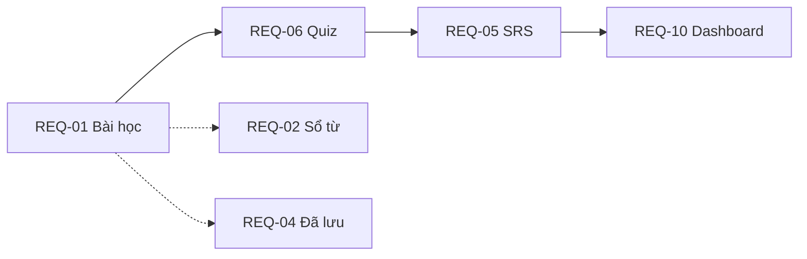

# Luồng người dùng theo chức năng (cross-FN)

> **SSOT nghiệp vụ:** [`process/00_requirement_business.md`](../process/00_requirement_business.md) (bảng §5, Gherkin §6)  
> **SSOT màn hình:** [`docs/02_system_design/sys_design_ux_ui.md`](../docs/02_system_design/sys_design_ux_ui.md) §4  
> **Orchestration code:** [`shared/learningFlow.ts`](shared/learningFlow.ts) · Mobile hook: [`apps/mobile/src/lib/learningFlowActions.ts`](../apps/mobile/src/lib/learningFlowActions.ts)  
> **Trạng thái triển khai:** [`process/00_global_task_list.md`](../process/00_global_task_list.md)

**Actor:** Người học (Learner) — không đăng nhập; định danh `device_id` (MVP).  
**Shell app:** 5 tab — Trang chủ · Gia sư AI · Đã lưu · Từ vựng · Tài khoản (`apps/mobile`).

---

## 1. Tổng quan điều hướng

```mermaid
flowchart TB
  Splash[Splash] --> Home[Trang chủ /home]
  Home --> Part[Part Detail FN-06]
  Home --> Lesson[Bài học FN-01]
  Home --> Tutor[Gia sư AI FN-07]
  TabSaved[Tab Đã lưu FN-04] --> Saved[/saved]
  TabVocab[Tab Từ vựng FN-02] --> VocabList[/vocab topic]
  VocabList --> Lesson
  VocabList --> AddWord[Thêm từ + AI FN-17]
  Part --> Quiz[Context Review FN-06]
  Lesson --> Quiz
  Lesson --> SRS[Ôn SRS FN-05]
  Quiz --> SRS
  SRS --> Account[Tab Tài khoản FN-10]
  Account --> Settings[Cài đặt FN-11]
  Lesson --> Saved
  AddWord --> Saved
```

| Tab / màn | Route gợi ý | REQ chính | Screen key (mobile) |
|-----------|---------------|-----------|---------------------|
| Splash | `/` | — | `splash` |
| Trang chủ | `/home` | REQ-01, REQ-06, REQ-10 | `home` |
| Part Detail | `/practice/:partId` | REQ-06 | `fn06_context_review` |
| Bài học từ | `/learn/vocab/:lessonId` | REQ-01, REQ-05 | `fn01_vocabulary` |
| Từ vựng (chủ đề) | `/vocab/:topicId` | REQ-02, REQ-17 | `fn02_vocab_manage` |
| Đã lưu | `/saved` | REQ-04 | `fn04_collection` |
| Gia sư AI | `/tutor` | REQ-07 | `fn07_ai_chat` |
| Tài khoản | `/account` | REQ-10 | `fn10_dashboard` |
| Cài đặt | `/settings` | REQ-11, REQ-15 (read) | `settings` |
| Luyện nói | `/learn/speaking` | REQ-08, REQ-09 | `fn08_speaking` |
| Câu giao tiếp | — | REQ-03 | `fn03_sentences` |
| Nhắc học | — | REQ-11 | `fn11_notifications` |

---

## 2. Luồng học chính (chuỗi MVP — khuyến nghị)

Thứ tự nghiệp vụ sau khi hoàn thành một **ngày học** (10 từ, lộ trình 7 ngày):



| Bước | REQ | Người dùng làm gì | Màn / tab | Use case / API |
|------|-----|-------------------|-----------|----------------|
| 0 | — | Mở app → **BẮT ĐẦU HỌC** | Splash → Home | `device_id`, anonymous auth |
| 1 | REQ-01 | Học từng từ: dialogue, phát âm, **Tiếp** | Home → Bài học | `getVocabularyLesson` |
| 1b | REQ-02/05/10 | Mỗi lần **Tiếp** | (trong bài học) | `completeVocabularyStudyStep` → sổ + SRS + XP |
| 2 | REQ-06 | Quiz ngữ cảnh từ bài vừa học | Part 1 hoặc Context Review | `buildContextReviewQuizFromLesson` → `recordContextQuizResult` |
| 3 | REQ-05 | Ôn flashcard **due** | (từ Home/Account hoặc sau quiz) | `getDueReviews` / `submitReview` (Again/Hard/Good/Easy) |
| 4 | REQ-10 | Xem streak, XP, thống kê | Tab **Tài khoản** | `getDashboardStats` |

**Điểm vào thay thế:** Trang chủ → card **Luyện Part N** (FN-06) hoặc **Bài học hôm nay** (FN-01).

### 2.1 Trang chủ (`home`) — phạm vi UI (MVP)

| Hiển thị | REQ | Screen | Ghi chú |
|----------|-----|--------|---------|
| Xin chào + 🔥 streak + ⭐ XP | REQ-10 | — | Chỉ tóm tắt; chi tiết → tab **Tài khoản** |
| **Bài học hôm nay** | REQ-01 | `fn01_vocabulary` | CTA chính |
| **Việc hôm nay** (khi có due) | REQ-05 | `fn05_spaced_repetition` | Ôn SRS |
| **Context Review · Part 1** | REQ-06 | `fn06_context_review` | Sau bài học / luyện quiz |
| — | REQ-07 | `fn07_ai_chat` | Tab **Gia sư AI** |
| — | REQ-02/04 | `fn02` / `fn04` | Tab **Từ vựng** / **Đã lưu** |
| — | REQ-10/11 | `fn10` / `settings` | Tab **Tài khoản** → Cài đặt |

**Không đặt trên Home (tránh trùng tab / stub):** grid Part 2/5/7 TOEIC, nút Nâng cấp → Account, icon Cài đặt/Nhắc học (đã có tab), lối tắt Speaking (REQ-08) cho đến khi có entry rõ trong flow.

---

## 3. Luồng theo từng chức năng (REQ)

Mỗi mục: **Mục tiêu** (từ §5 business) · **Luồng user** · **Ràng buộc QĐ** · **Liên FN** · **Trạng thái app**.

---

### REQ-01 — Học từ vựng theo ngữ cảnh (FN-01)

| | |
|---|---|
| **Mục tiêu** | Học từ trong ngữ cảnh công việc; **không** flashcard đơn lẻ. |
| **BM** | Màn **Vocabulary Learning** |
| **QĐ** | Bắt buộc context + example + topic + **dialogue 2–5 câu** (≥2 vai); từ mục tiêu có trong dialogue; audio phát âm. |

**Luồng user**

1. **Trang chủ** → «Bài học hôm nay» hoặc lộ trình ngày (7 ngày).
2. Màn **Bài học** — lần lượt từ: nghĩa, IPA, **hội thoại dạng chat**, nút nghe, **Tiếp**.
3. Hết bài → gợi ý **Context Review** (REQ-06) hoặc về Home.

**Hệ thống (sau mỗi «Tiếp»)**

- Ghi `user_vocabulary` (FN-02), enroll SRS (FN-05), +XP (FN-10) — `onVocabularyStepCompleted`.

**Liên FN:** FN-05, FN-06, FN-16 (import catalog).

**Trạng thái:** ✅ MVP (mobile + lesson seed/DB).

---

### REQ-02 — Quản lý từ vựng cá nhân (FN-02)

| | |
|---|---|
| **Mục tiêu** | CRUD từ cá nhân; favorite / difficult. |
| **BM** | Form **Thêm từ + AI preview**; danh sách chủ đề (tab **Từ vựng**) |
| **QĐ** | Gắn `device_id`; **preview AI (FN-17)** trước khi lưu. |

**Luồng user**

1. Tab **Từ vựng** → danh sách từ (word xanh + nghĩa xám) — chủ đề vd. «Hợp Đồng».
2. **Thêm từ:** nhập word/meaning/context/topic/role → **Gọi AI** (FN-17) → xem preview dialogue → **Lưu**.
3. Trên từ đã có: favorite, difficult, xóa khỏi sổ.
4. (Từ màn học FN-01) icon **lưu** → thêm vào sổ / collection (FN-04).

**Liên FN:** FN-17 (enrich), FN-04, FN-01.

**Trạng thái:** ✅ MVP.

---

### REQ-03 — Quản lý câu giao tiếp (FN-03)

| | |
|---|---|
| **Mục tiêu** | Lưu câu mẫu theo chủ đề (Standup, Scrum, Interview…). |
| **BM** | Màn quản lý câu |
| **QĐ** | CRUD; câu có context; liên collection. |

**Luồng user**

1. Vào màn **Câu giao tiếp** (truy cập phụ từ dev/quick — chưa tab chính).
2. Nhập câu EN + dịch + context + topic → **Lưu**.
3. Sửa / xóa; (sau này) thêm câu vào **Collection** (FN-04).

**Liên FN:** FN-04.

**Trạng thái:** ✅ CRUD cơ bản; chưa gắn tab bottom nav.

---

### REQ-04 — Learning Collection (FN-04)

| | |
|---|---|
| **Mục tiêu** | Bộ sưu tập từ/câu theo chủ đề. |
| **BM** | Màn **Đã lưu** (`/saved`) |
| **QĐ** | Tạo/sửa/xóa bộ; item `vocabulary` hoặc `sentence`; một item một collection tại thời điểm thêm. |

**Luồng user**

1. Tab **Đã lưu** → filter chip (Tất cả / Part 1 / …).
2. **Empty:** «Chưa có dữ liệu!» → **Thử lại** hoặc học/lưu từ bài học.
3. **Có data:** danh sách bộ + item; tạo bộ mới; thêm từ từ bài học hoặc sổ (FN-02).
4. (REQ-16) **Import** CSV/JSON vào bộ — phase sau.

**Liên FN:** FN-01, FN-02, FN-03, FN-12, FN-16.

**Trạng thái:** ✅ MVP (tab Đã lưu); import chưa có.

---

### REQ-05 — Spaced Repetition (FN-05)

| | |
|---|---|
| **Mục tiêu** | Ôn từ theo lịch Leitner/SM-2. |
| **BM** | Flashcard / queue ôn (trong hoặc sau bài học) |
| **QĐ** | Chọn Again/Hard/Good/Easy → `next_review`; schedule hôm nay cho FN-11. |

**Luồng user**

1. Sau FN-01/FN-06 hoặc từ **Tài khoản** / nhắc (FN-11) → màn **Ôn SRS**.
2. Xem từ **due** → lật thẻ → chọn mức độ.
3. Hết hàng đợi → về Home / Account.

**Hệ thống:** `submitReview`; kết quả FN-06 map Good/Again qua `recordContextQuizResult`.

**Liên FN:** FN-01, FN-06, FN-11.

**Trạng thái:** ✅ MVP.

---

### REQ-06 — Context Review (FN-06)

| | |
|---|---|
| **Mục tiêu** | Đoán nghĩa / chọn đáp án trong ngữ cảnh hội thoại. |
| **BM** | **Part Detail** + màn **Context Review** |
| **QĐ** | Đoạn có highlight từ; chấm đúng/sai; ghi progress. |

**Luồng user**

1. **Trang chủ** → «Luyện Part 1» (hoặc Part khác) → danh sách bài (Photographs 01…).
2. Chọn bài → **Quiz** (câu hỏi từ `lastLessonWords` / pool bài học).
3. Trả lời → phản hồi + SFX → câu tiếp / kết thúc → SRS hoặc Home.
4. Thanh «Bài học đề xuất» (gợi ý algorithm) — UI mockup.

**Hệ thống:** `buildContextReviewQuizFromLesson` → `onContextQuizAnswered`.

**Liên FN:** REQ-01 (nguồn từ), REQ-05.

**Trạng thái:** ✅ MVP (list Part + quiz).

---

### REQ-07 — AI Conversation (FN-07)

| | |
|---|---|
| **Mục tiêu** | Luyện hội thoại theo scenario. |
| **BM** | Tab **Gia sư AI** (dark theme) |
| **QĐ** | Chọn scenario; start/message; lưu transcript. |

**Luồng user**

1. Tab **Gia sư AI** → greeting Cuder + **gợi ý 2×2** (chụp câu hỏi, Part 1…).
2. Chọn scenario hoặc gợi ý → session chat.
3. Nhập tin / (sau) camera → gửi → AI trả lời.
4. Thoát → tab khác; transcript lưu DB.

**Liên FN:** FN-15 (`allow_ai_tutor`), Edge `ai-conversation`.

**Trạng thái:** ✅ MVP (Edge + mobile); phụ thuộc quyền admin.

---

### REQ-08 — Speech-to-Text (FN-08)

| | |
|---|---|
| **Mục tiêu** | Ghi âm → text; so với câu mẫu. |
| **BM** | **Speaking Practice** |
| **QĐ** | POST `/speech-to-text` (Edge). |

**Luồng user**

1. **Trang chủ** → Luyện Part 2 / Speaking → màn **Luyện nói**.
2. Xem câu mẫu → **Ghi âm** → gửi audio.
3. Nhận text → (REQ-09) chấm điểm.

**Liên FN:** FN-09, FN-10.

**Trạng thái:** ✅ Stub/Edge + mobile invoke.

---

### REQ-09 — Pronunciation Scoring (FN-09)

| | |
|---|---|
| **Mục tiêu** | Điểm phát âm, fluency, accuracy. |
| **BM** | Panel điểm trên Speaking |
| **QĐ** | Sau STT; lưu log/dashboard. |

**Luồng user**

1. Tiếp sau REQ-08 trên cùng màn Speaking.
2. Xem điểm / tiêu chí → (tùy) lưu vào tiến độ.

**Liên FN:** FN-08, FN-10.

**Trạng thái:** ✅ Gắn màn FN-08 (stub).

---

### REQ-10 — Dashboard học tập (FN-10)

| | |
|---|---|
| **Mục tiêu** | Streak, XP, thống kê; gamification. |
| **BM** | Tab **Tài khoản** (+ streak/XP trên Home) |
| **QĐ** | Đồng bộ từ progress & logs. |

**Luồng user**

1. Tab **Tài khoản** → profile, **Nâng cấp**, vòng điểm, thanh Nghe/Đọc, legend Đúng/Sai.
2. **Cài đặt** (góc phải) → FN-11.
3. **Xem lịch sử học** → SRS / Part (liên kết màn phụ).
4. Home hiển thị 🔥 streak + ⭐ XP (đồng bộ sau học/quiz).

**Liên FN:** FN-01, FN-05, FN-06, FN-08/09.

**Trạng thái:** ✅ MVP.

---

### REQ-11 — Notification Reminder (FN-11)

| | |
|---|---|
| **Mục tiêu** | Nhắc học ngắt quãng trong khung giờ. |
| **BM** | **Cài đặt → Thông báo** |
| **QĐ** | Ưu tiên từ due (FN-05); không spam; tắt được; local notification. |

**Luồng user**

1. **Tài khoản → Cài đặt** → mục **Nhắc nhở luyện tập**.
2. Màn **Nhắc học** → bật/tắt, khung giờ, khoảng cách, âm thanh nhắc (Settings toggle).
3. Đến mốc → push local → tap mở app (ưu tiên màn ôn SRS).

**Liên FN:** FN-05 (nội dung nhắc).

**Trạng thái:** ✅ Local push + settings.

---

### REQ-12 — Quick Capture (FN-12)

| | |
|---|---|
| **Mục tiêu** | Thêm từ từ app khác (Share / overlay). |
| **BM** | Share sheet **Cuder Học Tiếng**; overlay |
| **QĐ** | Text user chọn; bắt buộc context; lưu FN-02 + FN-04. |

**Luồng user (khi có)**

1. App khác → Share → Cuder → form từ + context.
2. Chọn collection → lưu (trùng từ → cập nhật hoặc bỏ qua).

**Trạng thái:** ⏳ Chưa có `src/fn12_*`.

---

### REQ-15 — Cấu hình thương hiệu & quyền (FN-15)

| | |
|---|---|
| **Mục tiêu** | Admin đổi logo/màu/tên/flags; learner chỉ đọc. |
| **BM** | Admin portal (sau); learner: theme từ DB |
| **QĐ** | Không UI sửa brand trong Cài đặt learner. |

**Luồng user (learner)**

1. Mở app → fetch `app_brand_config` + `app_system_config`.
2. Theme/logo/tên áp dụng; tab/màn ẩn theo `permissions` (vd. tắt Gia sư AI).

**Luồng admin (MVP):** Supabase Table Editor + Storage — xem `supabase/ADMIN_BRAND.md`.

**Trạng thái:** ✅ Read-only learner; admin UI phase sau.

---

### REQ-16 — Import bộ từ vựng (FN-16)

| | |
|---|---|
| **Mục tiêu** | Import CSV/JSON vào collection hoặc catalog. |
| **BM** | Collection → **Import** |
| **QĐ** | Validate dialogue 2–5 câu; format v1. |

**Luồng user (khi có)**

1. Tab **Đã lưu** → bộ học → **Import** → chọn file.
2. Báo cáo dòng OK/lỗi → item trong collection.

**Trạng thái:** ⏳ Chưa có `src/fn16_*`.

---

### REQ-17 — AI enrich hội thoại (FN-17)

| | |
|---|---|
| **Mục tiêu** | Sinh dialogue + explanation_native khi thêm từ. |
| **BM** | Form FN-02 preview; Edge `vocab-enrich` |
| **QĐ** | Mode full/enrich; 2–5 câu; theo ngôn ngữ mẹ đẻ; flag `allow_ai_vocab_enrich`. |

**Luồng user**

1. Tab **Từ vựng** → form thêm từ → chọn mode **full** / **enrich**.
2. **Gọi AI** → preview (dialogue + giải thích VI) → chỉnh nếu cần → **Lưu** (FN-02).
3. (Hệ thống) Edge gọi LLM; perf smoke k6/BDD `@perf`.

**Liên FN:** FN-02, FN-01 (chuẩn dialogue).

**Trạng thái:** ✅ Edge + form mobile.

---

## 4. Phase 2 (ngoài MVP)

| REQ | Luồng tóm tắt |
|-----|----------------|
| **REQ-13** | Mobile hiển thị mã 6 số → Web nhập mã → đồng bộ từ/collection/progress. |
| **REQ-14** | Thêm bạn → bảng xếp hạng XP tuần + rank (Gà con → Thần IELTS). |

Chi tiết Gherkin: `00_requirement_business.md` §9.

---

## 5. Ma trận phụ thuộc REQ

| REQ | Phụ thuộc | Ghi chú |
|-----|-----------|---------|
| REQ-05 | REQ-01 | Cần từ đã học / enroll |
| REQ-06 | REQ-01, REQ-05 | Quiz từ bài học; ghi SRS |
| REQ-10 | REQ-01, REQ-05, REQ-06, REQ-08/09 | XP/streak |
| REQ-04 | REQ-02, REQ-03 | Item từ/câu |
| REQ-02 | REQ-17 (tuỳ chọn) | Preview trước lưu |
| REQ-11 | REQ-05 | Nội dung nhắc ưu tiên due |
| REQ-09 | REQ-08 | Sau STT |
| REQ-16 | REQ-01, REQ-04 | Validate dialogue |
| REQ-12 | REQ-02, REQ-04 | Capture → sổ + bộ |

---

## 6. Code map — `LEARNING_FLOW_STEPS`

Thứ tự gợi ý trên mobile (export từ `shared/learningFlow.ts`):

| order | screen | label | REQ |
|-------|--------|-------|-----|
| 1 | `fn01_vocabulary` | Bài học từ | REQ-01 |
| 2 | `fn06_context_review` | Context Review | REQ-06 |
| 3 | `fn05_spaced_repetition` | Ôn SRS | REQ-05 |
| 4 | `fn10_dashboard` | Tiến độ | REQ-10 |

Các FN không nằm trong chuỗi tự động: REQ-03, 04, 07, 08, 09, 11, 15, 17 — truy cập qua tab hoặc màn phụ (§3).

---

## 7. Lịch sử tài liệu

| Ngày | Thay đổi |
|------|----------|
| 2026-05-28 | Tạo luồng cross-FN MVP |
| 2026-05-31 | §2.1 phạm vi Trang chủ MVP — bỏ grid Part thừa; map CTA → REQ-01/05/06 |
| 2026-05-31 | Viết lại §3 luồng user **từng REQ** theo `00_requirement_business.md` §5–6; map tab UX §4; REQ-12/15/16/17 + Phase 2 |
